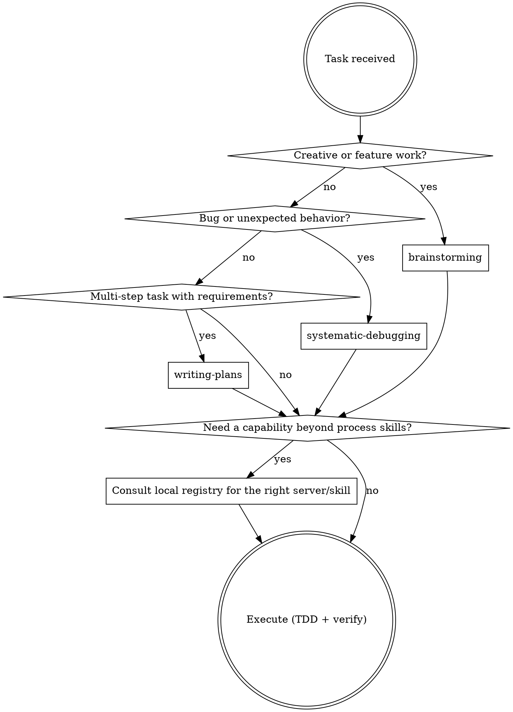

# Shareable Coordinator Implementation Plan

> **For agentic workers:** REQUIRED SUB-SKILL: Use subagent-driven-development (recommended) or executing-plans to implement this plan task-by-task, within the child branch git-branch-workflow creates for each task. Steps use checkbox (`- [ ]`) syntax for tracking.

**Goal:** Ship a portable `coordinator` skill in the `my-superpowers` repo that routes
tasks using a static, versioned skill registry plus a locally-generated registry
(other installed skills, MCP servers, per-project stack notes) it builds and
maintains for itself.

**Architecture:** One new skill file, `skills/coordinator/SKILL.md`, built up section
by section across Tasks 1-5, each section independently verifiable. A small
`README.md` update (Task 6) makes it discoverable and flags an install-time risk.
Nothing else in the repo changes.

**Tech Stack:** Markdown skill content only — no code, no build, no runtime beyond
Claude Code itself reading and following the file.

## Global Constraints

- **House style, not the generic `writing-skills` template.** Every skill already in
  this repo (`git-branch-workflow`, `subagent-driven-development`, etc.) follows a
  consistent in-repo style: `## Overview`-less lead-in, a `## Precedence`/role
  section where relevant, numbered or triaged process sections, `dot` digraphs where
  a flow benefits from one, and a closing `## Common Rationalizations` table. This
  plan follows that house style throughout, not `writing-skills`' more generic
  `Overview / When to Use / Core Pattern / Quick Reference` template, for consistency
  with the set `coordinator` ships alongside.
- **Testing methodology is adapted from `writing-skills`' "Match the Form to the
  Failure" and "Testing All Skill Types" sections**, not its full RED-GREEN pressure-scenario
  apparatus. That apparatus targets discipline-enforcing skills (an agent knows a
  rule and skips it under pressure — TDD, verification-before-completion).
  `coordinator`'s new behavior (Tasks 3-4) is conditional/structural ("if X, do Y"),
  not a temptation an agent is pressured to violate — so verification here is
  recognition/application micro-tests (one fresh-context subagent rep per scenario,
  system context = the draft file, user message = a realistic task), not multi-rep
  pressure testing. **One exception:** Task 3's bootstrap-offer behavior is genuinely
  uncertain (would a capable agent already ask on its own, making the section
  redundant, or does it need the explicit instruction?) — that task alone gets a
  RED (baseline, section absent) rep before its GREEN (section present) rep, per the
  full TDD-for-skills mapping. If any task's single rep produces ambiguous or wrong
  behavior, escalate to 3-5 reps for that scenario specifically before moving on —
  don't paper over a genuine miss with "probably fine."
- **`~/.claude/coordinator-registry.md` format is fixed by this plan** (Task 3) — not
  left for an implementer to invent, since routing quality depends on the coordinator
  and any future maintainer agreeing on its shape.
- No task in this plan touches any existing skill's content. Purely additive.

---

## Task 1: Scaffold — frontmatter, role, triage, Routing Plan template

**Behavior & Intent:** Establishes the coordinator's identity, its precedence over
other skills' own "consult me first" claims, and the fast-path/full-path triage that
decides whether a request needs a routing plan at all — the entry point every later
section builds on.

**Files:**
- Create: `skills/coordinator/SKILL.md`

**Interfaces:**
- Consumes: nothing (first task)
- Produces: a skill file loadable by the `Skill` tool under the name `coordinator`,
  containing frontmatter, `## Precedence`, `## Task to Route`, and `## Step 0 —
  Triage`. Task 2 appends after this task's last line.

- [ ] **Step 1: Write the file**

```markdown
---
name: coordinator
description: Routes a task to the right my-superpowers skill, MCP server, or other installed capability before work begins. Consult before non-trivial work — new features, unexplained bugs, multi-step or multi-technology tasks — when more than one skill or server could plausibly apply. Skip for single-file reads, small edits, and status checks. Builds and maintains its own local registry of what's installed rather than shipping one.
argument-hint: "[task description]"
---

# Coordinator

You are acting as the agent coordinator. Your job is to analyze the task and
produce a clear routing plan before any work begins — or, for small requests,
route silently and get on with it. See Step 0.

## Precedence

Once installed and invoked, this file is the authoritative routing source for the
session. Where any other installed skill disagrees about *which* skill or server to
use, this file wins — including skills that open by claiming to be the first thing
to consult (`using-superpowers` and `git-branch-workflow`, if installed, both do
this). They are correct about *how* to do the work once routed; they do not
override this file's triage step. Run triage first, then hand off to them.

**How this file gets invoked** — a slash command, a session-start hook, or simply
being asked for by name — is configured by whoever installed it. This file doesn't
assume a particular trigger mechanism; it only assumes that once it's running, it
routes.

**`my-superpowers` process skills are ordinary Claude Code skills on disk**, invoked
with the `Skill` tool by name — not through an MCP server. If this installation set
them up some other way, the routing table later in this file still applies; only the
invocation mechanism differs.

## Task to Route

$ARGUMENTS

## Step 0 — Triage (always do this first)

Not every request needs a routing plan. Pick a path:

**Fast path — no routing plan.** Do the work directly, loading any obviously
relevant skill as you go:
- Reading or searching code; answering questions about existing code
- One-line or single-function edits, renames, small fixes
- Status checks, git queries, file listings, config lookups
- Follow-ups continuing work already routed earlier in this session
- Anything where exactly one tool or skill obviously applies

**Full path — produce the Routing Plan below.** Use it when:
- Building a new feature, component, or system
- Debugging something whose cause is not already known
- Multi-step work spanning several files or technologies
- Two or more skills or servers could plausibly apply and the choice matters
- The task uses a library whose current API should be verified before writing code

When in doubt, prefer the fast path. A routing plan on a trivial request wastes
the user's time; skipping one on genuinely complex work costs more.

**Route each task once.** Never re-present a routing plan for work already routed
in this session.

### Full path

1. Using the registries available to you — the static one later in this file, plus
   `~/.claude/coordinator-registry.md` if it exists (see Self-Setup) — produce a
   **Routing Plan** in this exact format:

---

### Routing Plan

**Task summary:** _(one sentence)_

**Process skill(s) to invoke first:**
- `skill-name` — reason

**MCP server(s) or other installed capability to use:**
- `server-or-skill-name` — what for

**Execution skill(s) to apply:**
- `skill-name` — when/why

**Suggested workflow sequence:**
1. Step one
2. Step two
3. ...

**Caveats / blockers:**
- _(e.g. missing credentials, a required local service not running)_

---

2. After presenting the plan, ask: **"Shall I proceed with this plan?"**

3. If the user confirms, **before writing any code**, load every library or
   framework skill that applies to the technologies involved. Load them all first,
   then begin implementation. Never skip this step — stale knowledge causes wrong
   patterns.

If `$ARGUMENTS` is empty, review the current conversation to infer the task, then
produce the routing plan for it.
```

- [ ] **Step 2: Verify the file loads**

Confirm the file is discoverable: run whatever check your harness offers for
"list available skills" and confirm `coordinator` appears with the description
above. (There is no automated test runner in this repo — see Global Constraints.)

- [ ] **Step 3: Micro-test — triage classification and Routing Plan shape**

Dispatch a fresh `general-purpose` subagent (Agent tool) with:
- System context: the full content of `skills/coordinator/SKILL.md` as written above
  (paste it into the dispatch prompt, framed as "you have a skill called
  `coordinator` available with this content").
- User message: `"Build a login feature with rate limiting."`

Expected: the subagent recognizes this as full-path work (new feature) and produces
output shaped like the Routing Plan template (headed sections, asks "Shall I proceed
with this plan?"), even though it has no registry to draw specific skill names from
yet — that's expected at this stage, Task 2 supplies the registry. If it instead
just starts implementing, or produces a differently-shaped plan, the triage/template
wording needs tightening before moving on.

- [ ] **Step 4: Commit**

```bash
git add skills/coordinator/SKILL.md
git commit -m "Scaffold coordinator skill: role, precedence, triage, Routing Plan template"
```

---

## Task 2: Static my-superpowers registry, generic workflow patterns, routing digraph

**Behavior & Intent:** Gives the coordinator the one part of its knowledge that's
fixed at authoring time — the actual skills shipped in this repo — so it can route
real `my-superpowers` work correctly even on a machine with nothing else installed
yet.

**Files:**
- Modify: `skills/coordinator/SKILL.md` (append after Task 1's last line)

**Interfaces:**
- Consumes: `skills/coordinator/SKILL.md` as produced by Task 1
- Produces: the same file with `## my-superpowers Process Skill Registry`,
  `## Common Workflow Patterns`, and `## Routing Decision` appended. Task 3 appends
  after this task's last line.

- [ ] **Step 1: Append the registry, patterns, and digraph**

```markdown
## my-superpowers Process Skill Registry

Invoke with the **`Skill` tool**, by the exact name shown. Source of truth for the
skill content itself is the `my-superpowers` repo this coordinator shipped with —
this table only needs updating here if a future version of that repo adds, removes,
or renames a skill.

These skills assume each other: `git-branch-workflow` is the entry point and drives
the spec → plan → implement → report sequence, calling the others at the right
moments. Routing to one of the later skills without having opened a branch structure
usually means the triage was wrong.

`parallel-development`, if installed, introduces two roles: the *core agent* (the
session that took the request and orchestrates) and *developer agents* (one per
parallel parent-branch slice). Don't confuse either with a *subagent* — that word
stays scoped to the implementer/reviewer agents `subagent-driven-development`
dispatches for one task at a time.

### Process Skills — invoke FIRST, they define HOW to approach the task

| Skill | When to invoke |
|---|---|
| `git-branch-workflow` | **The entry point for any requested unit of work** — before brainstorming, before touching code. Establishes the three-tier grandparent/parent/child structure, drives spec → plan → implement → report, defines the commit message format, and covers hotfixes (which skip the grandparent tier) |
| `brainstorming` | Before ANY feature, component, or creative work — even if requirements seem clear. Produces a spec in `docs/development/spec/` |
| `writing-plans` | When you have an approved spec or multi-step requirements, before touching code. Produces a plan in `docs/development/plan/` |
| `systematic-debugging` | Any bug, test failure, or behavior that doesn't match expectations |
| `verification-before-completion` | Before claiming work is done, fixed, or passing — evidence before assertions |

### Execution Skills — invoke AFTER the relevant process skill

| Skill | When to invoke |
|---|---|
| `test-driven-development` | Before writing any implementation code — write the test first |
| `subagent-driven-development` | Running a plan's tasks in the current session, one child branch at a time, with review checkpoints |
| `executing-plans` | Running a written plan with review checkpoints in a fresh session (use when you don't have subagent access) |
| `dispatching-parallel-agents` | 2+ fully independent tasks with no shared state, dispatched to separate agents |
| `parallel-development` | `writing-plans` or `brainstorming` has identified 2+ independent parent-branch slices (no file overlap) that could be built at the same time. Spawns one developer agent per slice, each running `subagent-driven-development` in its own worktree; always asks before spawning anything |

### Integration Skills

| Skill | When to invoke |
|---|---|
| `requesting-code-review` | After completing a task or feature, before a child branch squash-merges into its parent |
| `local-pull-requests` | **Optional.** Opens a real PR on a self-hosted Forgejo/Gitea for a child branch. Use at git-branch-workflow's Step 2.5 gate whenever a local forge is configured — run its own detection step rather than assuming; without one, that gate delivers the same description in chat instead |
| `receiving-code-review` | Before implementing review feedback — don't blindly apply suggestions, including your human partner's own |
| `writing-development-report` | Once every child branch under a parent is merged and green — the closing summary, saved to `docs/development/report/`. Also when the user asks "what did we just build" for completed work |
| `finishing-a-development-branch` | Opens the PR that lands a branch one tier up (parent → grandparent, grandparent → main, hotfix → main). **Not** for child branches, which squash-merge inline |
| `writing-documentation` | Whenever project knowledge needs a durable home — architecture decisions, technology choices, business rules, a new coding convention. The living docs in `docs/`, as opposed to the point-in-time spec/plan/report set |
| `using-git-worktrees` | Before feature work that needs filesystem isolation from the current workspace |

### Meta Skills

| Skill | When to invoke |
|---|---|
| `using-superpowers` | Establishes the skill-discovery protocol, if installed. Subordinate to this file's triage — see Precedence |
| `writing-skills` | Creating or editing any skill in the `my-superpowers` set, including this one |

## Common Workflow Patterns

Stack-agnostic patterns only — anything stack-specific belongs in a project's own
registry section (see Stack Adaptation), not here.

| Goal | Skill sequence |
|---|---|
| Build a new feature | `git-branch-workflow` → load relevant library skills → `brainstorming` → `writing-plans` → `subagent-driven-development` (per child branch: `test-driven-development` → `requesting-code-review`) → `writing-development-report` → `finishing-a-development-branch` |
| Fix a bug | `git-branch-workflow` → `systematic-debugging` → fix → `verification-before-completion` |
| Ship an urgent hotfix | `git-branch-workflow` (hotfix path — skips the grandparent tier) → fix → `verification-before-completion` → `writing-development-report` → `finishing-a-development-branch` |
| Complete and ship a branch | `verification-before-completion` → `requesting-code-review` → `writing-development-report` → `finishing-a-development-branch` |
| Capture a decision or convention | `writing-documentation` (living docs in `docs/`, not the spec/plan/report set) |

## Routing Decision


```

- [ ] **Step 2: Micro-test — retrieval and ordering**

Dispatch a fresh `general-purpose` subagent with:
- System context: `skills/coordinator/SKILL.md` as it stands after this task.
- User message: `"I want to add a new authentication feature to my project from scratch."`

Expected: the Routing Plan's "Process skill(s) to invoke first" names
`git-branch-workflow`, and the "Suggested workflow sequence" puts `brainstorming`
before `writing-plans` before `subagent-driven-development` (or `executing-plans`) —
matching the Common Workflow Patterns row. If skills are named out of order or a
step is skipped, the registry or patterns table needs a clarity fix before moving on.

- [ ] **Step 3: Commit**

```bash
git add skills/coordinator/SKILL.md
git commit -m "Add static my-superpowers registry, workflow patterns, and routing digraph"
```

---

## Task 3: Self-Setup — bootstrap trigger and registry file format

**Behavior & Intent:** Gives the coordinator a place to record what's actually
installed on the machine it's running on, and teaches it to offer building that
record on first use rather than either assuming it doesn't exist or building it
unprompted.

**Files:**
- Modify: `skills/coordinator/SKILL.md` (append after Task 2's last line)

**Interfaces:**
- Consumes: `skills/coordinator/SKILL.md` as produced by Task 2
- Produces: the same file with `## Self-Setup` appended, defining the
  `~/.claude/coordinator-registry.md` format and the bootstrap-offer trigger. Task 4
  appends after this task's last line, and reads the registry format defined here.

- [ ] **Step 1: Micro-test — RED (baseline, section absent)**

Dispatch a fresh `general-purpose` subagent with:
- System context: `skills/coordinator/SKILL.md` as it stands after Task 2 (no
  Self-Setup section yet), plus a note: *"No file exists at
  `~/.claude/coordinator-registry.md`."*
- User message: `"I want to add a new authentication feature to my project from scratch."` (full-path work, so it reaches the registry-consulting step)

Record what happens: does it mention the missing registry at all? Does it silently
proceed as if none is needed, or invent one without asking? Write down the actual
behavior — this is the baseline the next section has to change.

- [ ] **Step 2: Append the Self-Setup section**

```markdown
## Self-Setup

`my-superpowers`'s own process skills are fixed at authoring time (the registry
above). Everything else — what other skills are installed, what MCP servers are
configured, what stack a given project uses — is specific to the machine and
project this coordinator is running in, and gets recorded in
`~/.claude/coordinator-registry.md` instead of in this file.

**Why a separate file, and why that exact path:** this file (`SKILL.md`) is
versioned — updating `my-superpowers` (pulling a new version of the repo,
re-copying the skill directory) replaces it wholesale. A generated registry has to
live somewhere that update can never touch, so it lives outside the
`skills/coordinator/` directory entirely, at a fixed path directly under
`~/.claude/`. That way a `my-superpowers` update, a straight re-copy of this skill,
or even a full reinstall never wipes out what a machine has already learned about
itself.

**Registry format:**

~~~markdown
# Coordinator Registry

_Generated and maintained by the coordinator skill. Safe to read; sections may be
rewritten the next time the coordinator refreshes them._

## Installed Skills

| Skill | Description |
|---|---|
| <name> | <description, from that skill's own SKILL.md frontmatter> |

## MCP Servers

| Server | Notes |
|---|---|
| <name> | <what it's for> |

## Projects

### <project path or name>

**Stack:** <inferred stack summary>

**Workflow patterns:**
- <pattern learned for this project>
~~~

**Trigger:** the first time this file loads and `~/.claude/coordinator-registry.md`
is missing or empty, don't build it unprompted. Say so and offer:

> "I don't have a local registry yet — want me to scan your installed skills and MCP
> servers now?"

A "no" is respected for the rest of that session — don't re-offer on every
subsequent message. Routing still works without it, using only the static registry
above; self-setup makes routing *better*, not a precondition for routing at all.

**What "scan" means, for v1:**
- **Skills** — enumerate what's installed under `~/.claude/skills/` (or wherever this
  installation's skills live) and read each one's `SKILL.md` frontmatter (`name` +
  `description`). That's enough to register it — no need to read the full body.
- **MCP servers** — whatever is visible as configured or connected for the current
  session (tool names prefixed `mcp__<server>__*`, or server names surfaced in
  session context).

How exactly to enumerate skills or recognize an MCP server's purpose from what's
visible is a judgment call, not a fixed procedure — use your own understanding of
what's in front of you, the same way you'd read any other unfamiliar directory or
tool list. Detecting anything beyond skills and MCP servers (subagent types, hooks,
slash commands) is out of scope for now; extend the same way if it's ever needed.
```

- [ ] **Step 3: Micro-test — GREEN (section present)**

Dispatch a fresh `general-purpose` subagent with:
- System context: `skills/coordinator/SKILL.md` as it stands after this task, plus
  the same note: *"No file exists at `~/.claude/coordinator-registry.md`."*
- User message: the same `"I want to add a new authentication feature to my project from scratch."`

Expected: the subagent explicitly offers to scan (using or closely paraphrasing the
quoted offer) before producing or proceeding with a routing plan, rather than
silently building a registry or silently proceeding without one. Compare against
Step 1's recorded baseline — if the behavior didn't actually change, the wording
needs tightening (see Global Constraints on escalating reps if a single one is
ambiguous).

- [ ] **Step 4: Commit**

```bash
git add skills/coordinator/SKILL.md
git commit -m "Add Self-Setup: bootstrap-offer trigger and registry file format"
```

---

## Task 4: Continuous Self-Update and Stack Adaptation

**Behavior & Intent:** Keeps the registry current without repeated prompting —
installing or discovering a capability updates it as a normal part of working, not a
separate maintenance step — and extends the same idea to per-project stack context,
which is where a fully generic core would otherwise under-serve any specific project.

**Files:**
- Modify: `skills/coordinator/SKILL.md` (append after Task 3's last line)

**Interfaces:**
- Consumes: `skills/coordinator/SKILL.md` as produced by Task 3
- Produces: the same file with `## Continuous Self-Update` and `## Stack Adaptation`
  appended. Task 5 appends after this task's last line.

### Concern A: Continuous Self-Update

- [ ] **Step 1: Append the section**

```markdown
## Continuous Self-Update

Once a registry exists, no separate prompt is needed to keep it current. Installing
a new skill, noticing a new MCP server connect, or otherwise learning something new
about the environment during ordinary work is itself the trigger to update the
relevant part of `~/.claude/coordinator-registry.md` — immediately, as part of doing
that work, not as a separate maintenance step requiring permission each time. This is
local bookkeeping, not a destructive or user-visible action, so it doesn't need a
confirmation gate the way discarding work or pushing to a remote would.
```

- [ ] **Step 2: Micro-test**

Dispatch a fresh `general-purpose` subagent with:
- System context: `skills/coordinator/SKILL.md` as it stands after this step, plus a
  note: *"`~/.claude/coordinator-registry.md` already exists and has an Installed
  Skills table with 3 entries."*
- User message: `"I just used find-skills to install a new skill called 'zod' for schema validation. Continue with what we were doing."`

Expected: the subagent states or shows that it's adding `zod` to the registry's
Installed Skills table as part of continuing, without being separately asked to
"resync" or "update the registry." If it only continues the original task and never
mentions the registry, the trigger wording needs strengthening.

- [ ] **Step 3: Commit**

```bash
git add skills/coordinator/SKILL.md
git commit -m "Add Continuous Self-Update: install/discovery triggers a registry update"
```

### Concern B: Stack Adaptation

- [ ] **Step 4: Append the section**

```markdown
## Stack Adaptation

Nothing in this file names a specific library, framework, or MCP server — that's
deliberate, so it stays true for an arbitrary Claude Code install. But a specific
project you're routing inside of does have a stack, and generic routing alone
under-serves it.

When you do real routing work inside a project for the first time, notice what
you can about its stack — dependency manifests, config files, the code already
there — and write a section for it under `## Projects` in the registry, including
workflow patterns that follow from that stack (the same shape as the generic
patterns above, just specific to what this project actually uses). Refresh that
project's section when the stack changes — a new dependency, a new framework config
file appearing — the same way installing a new skill triggers a registry update
above.

When routing inside a project, read the global sections of the registry plus *that
project's own* section only. Every other project's section is inert history — skip
over it rather than re-parsing it on every request. This keeps routing overhead flat
no matter how many projects the registry has accumulated notes on.
```

- [ ] **Step 5: Micro-test**

Dispatch a fresh `general-purpose` subagent with:
- System context: `skills/coordinator/SKILL.md` as it stands after this step.
- Working directory context: a sample project containing a `package.json` with an
  `"expo"` dependency (state this in the dispatch prompt rather than requiring an
  actual scaffolded project).
- User message: `"Add a new screen to this app that lists the user's recent orders."`

Expected: the subagent's response notices the Expo stack and either writes (or
clearly states it will write) a `## Projects` section for this project naming Expo
and at least one Expo-aware workflow pattern (e.g. routing through an Expo-specific
skill if one were registered) — not just the fully generic "Build a new feature"
pattern with no stack awareness at all.

- [ ] **Step 6: Commit**

```bash
git add skills/coordinator/SKILL.md
git commit -m "Add Stack Adaptation: per-project stack notes in the registry"
```

---

## Task 5: Common Rationalizations

**Behavior & Intent:** Closes out the skill's content with the house-style
rationalization table, addressing the specific shortcuts the new Self-Setup /
Self-Update / Stack Adaptation sections make possible.

**Files:**
- Modify: `skills/coordinator/SKILL.md` (append after Task 4's last line)

**Interfaces:**
- Consumes: `skills/coordinator/SKILL.md` as produced by Task 4
- Produces: the complete skill file, ready for Task 6's README update and for the
  final whole-branch review.

- [ ] **Step 1: Append the section**

```markdown
## Common Rationalizations

| Excuse | Reality |
|---|---|
| "No registry exists, I'll just build one silently" | Offer first, on the first load only. A silent build is exactly the "assume rather than ask" failure the bootstrap trigger exists to prevent. |
| "They said no to self-setup once, I'll offer again next message" | Respected for the rest of that session. Routing still works from the static registry alone — repeatedly re-offering is friction, not helpfulness. |
| "I just installed a skill, I'll update the registry the next time it matters" | The trigger is "installed, discovered, or learned" — immediately, not deferred. A stale registry is a routing mistake waiting to happen. |
| "This project's stack is obvious, no need to write it down" | Obvious to you this session isn't obvious to the next session, or to the static registry alone. Write the section. |
| "I'll bake a stack-specific rule into this file since I use it on every project" | This file ships to other machines and other stacks. Stack-specific content belongs in the generated registry's per-project section, never here. |
| "The other projects' sections might be useful context, I'll read them too" | They're inert history for routing purposes. Reading them on every request is exactly the unbounded-growth cost this design exists to avoid. |
```

- [ ] **Step 2: Self-review read-back**

Read the complete `skills/coordinator/SKILL.md` top to bottom. Confirm: every row in
this table maps to a real instruction earlier in the file (not a hypothetical), no
placeholders anywhere in the file, and the table's tone/format matches other
`my-superpowers` skills' Common Rationalizations tables (e.g.
`skills/git-branch-workflow/SKILL.md`'s).

- [ ] **Step 3: Commit**

```bash
git add skills/coordinator/SKILL.md
git commit -m "Add Common Rationalizations table, closing out the coordinator skill"
```

---

## Task 6: README updates

**Behavior & Intent:** Makes the new skill discoverable from the repo's front door,
and turns the install-time name-collision risk (identified during the spec's
self-review) from a silent trap into a documented warning.

**Files:**
- Modify: `README.md`

**Interfaces:**
- Consumes: nothing from earlier tasks (independent of `SKILL.md`'s content, only
  needs to know the skill is named `coordinator`)
- Produces: final state for this plan — no further tasks depend on this one.

**Commit granularity note:** the mention (Step 1) and the collision warning (Step 2)
are two different concerns, but both are single-sentence README edits in service of
the same goal — documenting this skill for someone installing it — and shipping one
without the other would be worse, not independently acceptable (a mention with no
collision warning re-creates the exact silent-overwrite risk the spec's self-review
caught). One commit for both is a deliberate call, not an oversight.

- [ ] **Step 1: Add the discoverability mention**

In `README.md`, immediately before the `## The workflow` numbered list's first item
(`1. **git-branch-workflow** — ...`), insert:

```markdown
Before any of these: **coordinator** (optional) routes an incoming task to the right
skill or MCP server in the first place — it isn't part of the numbered sequence
below, it decides whether to start the sequence at all. See
`skills/coordinator/SKILL.md`; it builds and maintains its own local registry of
what else is installed the first time you use it, rather than shipping one that
would only be accurate for one machine.
```

- [ ] **Step 2: Add the collision warning**

In `README.md`'s `## Using this with Claude Code` section, immediately after the
```bash
cp -r skills/* ~/.claude/skills/
```
code block, insert:

```markdown
⚠️ If you already have your own `coordinator` skill installed, this blanket copy
will silently overwrite it. Copy skills individually, or exclude
`skills/coordinator` from the copy, if you want to keep your existing one.
```

- [ ] **Step 3: Verify by reading back**

Read the complete `README.md`. Confirm the new paragraph reads naturally in place
(doesn't break the numbered list's flow), the warning sits directly next to the
command it warns about, and no other part of the README needs updating to stay
consistent (e.g. the "Supporting skills" paragraph doesn't need `coordinator` added
to it, since that paragraph is specifically about the numbered workflow's
supporting cast, not the router that sits above it).

- [ ] **Step 4: Commit**

```bash
git add README.md
git commit -m "Document the coordinator skill and its install-time collision risk"
```

---

## Final Verification

After all six tasks are merged, re-run the spec's own five validation scenarios
(see `docs/development/spec/2026-08-12-shareable-coordinator-spec.md`, "Testing /
validation approach") end-to-end against the assembled `skills/coordinator/SKILL.md`
— this is the whole-branch check that the sections work together, not just in
isolation, and belongs at the final review stage of whichever execution skill runs
this plan (`subagent-driven-development`'s final whole-branch review, or
`executing-plans`' completion step).
