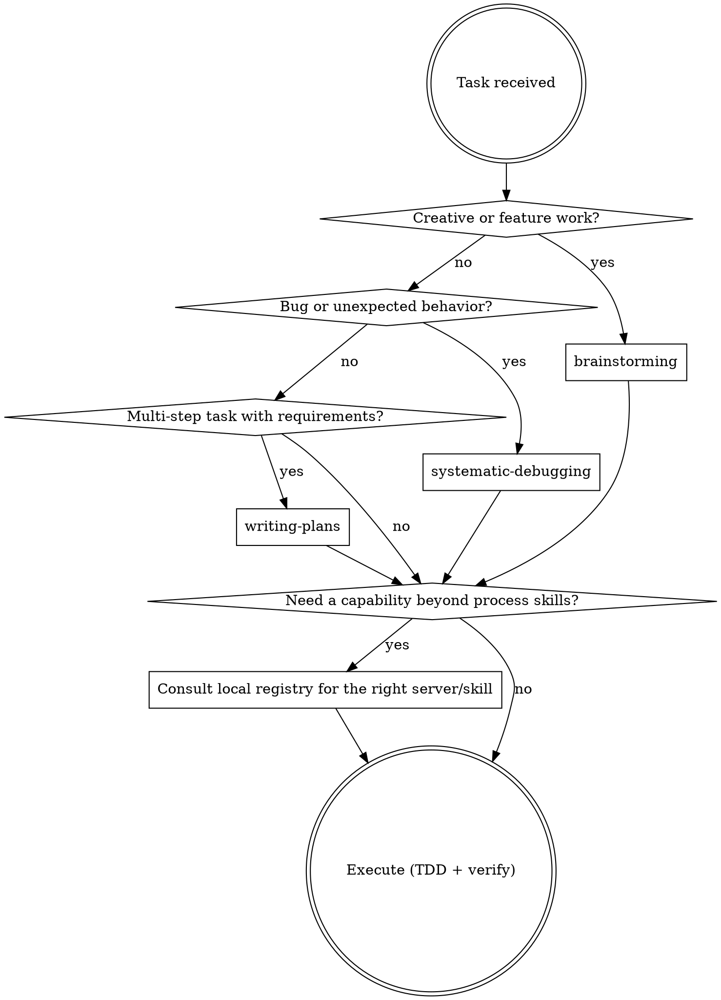

# Coordinator

You are acting as the agent coordinator. Your job is to analyze the task and
produce a clear routing plan before any work begins — or, for small requests,
route silently and get on with it. See Step 0.

## Precedence

Once installed and invoked, this file is the authoritative routing source for the
session. Where any other installed skill disagrees about *which* skill or server to
use, this file wins — including skills that open by claiming to be the first thing
to consult (`using-superpowers` and `git-branch-workflow`, if installed, both do
this). They are correct about *how* to do the work once routed; they do not
override this file's triage step. Run triage first, then hand off to them.

**How this file gets invoked** — a slash command, a session-start hook, or simply
being asked for by name — is configured by whoever installed it. This file doesn't
assume a particular trigger mechanism; it only assumes that once it's running, it
routes.

**`my-superpowers` process skills are ordinary Claude Code skills on disk**, invoked
with the `Skill` tool by name — not through an MCP server. If this installation set
them up some other way, the routing table later in this file still applies; only the
invocation mechanism differs.

## Task to Route

$ARGUMENTS

## Step 0 — Triage (always do this first)

Not every request needs a routing plan. Pick a path:

**Fast path — no routing plan.** Do the work directly, loading any obviously
relevant skill as you go:
- Reading or searching code; answering questions about existing code
- One-line or single-function edits, renames, small fixes
- Status checks, git queries, file listings, config lookups
- Follow-ups continuing work already routed earlier in this session
- Anything where exactly one tool or skill obviously applies

**Full path — produce the Routing Plan below.** Use it when:
- Building a new feature, component, or system
- Debugging something whose cause is not already known
- Multi-step work spanning several files or technologies
- Two or more skills or servers could plausibly apply and the choice matters
- The task uses a library whose current API should be verified before writing code

When in doubt, prefer the fast path. A routing plan on a trivial request wastes
the user's time; skipping one on genuinely complex work costs more.

**Route each task once.** Never re-present a routing plan for work already routed
in this session.

### Full path

1. Using the registries available to you — the static one later in this file, plus
   `~/.claude/coordinator-registry.md` if it exists (see Self-Setup) — produce a
   **Routing Plan** in this exact format:

---

### Routing Plan

**Task summary:** _(one sentence)_

**Process skill(s) to invoke first:**
- `skill-name` — reason

**MCP server(s) or other installed capability to use:**
- `server-or-skill-name` — what for

**Execution skill(s) to apply:**
- `skill-name` — when/why

**Suggested workflow sequence:**
1. Step one
2. Step two
3. ...

**Caveats / blockers:**
- _(e.g. missing credentials, a required local service not running)_

---

2. After presenting the plan, ask: **"Shall I proceed with this plan?"**

3. If the user confirms, **before writing any code**, load every library or
   framework skill that applies to the technologies involved. Load them all first,
   then begin implementation. Never skip this step — stale knowledge causes wrong
   patterns.

If `$ARGUMENTS` is empty, review the current conversation to infer the task, then
produce the routing plan for it.

## my-superpowers Process Skill Registry

Invoke with the **`Skill` tool**, by the exact name shown. Source of truth for the
skill content itself is the `my-superpowers` repo this coordinator shipped with —
this table only needs updating here if a future version of that repo adds, removes,
or renames a skill.

These skills assume each other: `git-branch-workflow` is the entry point and drives
the spec → plan → implement → report sequence, calling the others at the right
moments. Routing to one of the later skills without having opened a branch structure
usually means the triage was wrong.

`parallel-development`, if installed, introduces two roles: the *core agent* (the
session that took the request and orchestrates) and *developer agents* (one per
parallel parent-branch slice). Don't confuse either with a *subagent* — that word
stays scoped to the implementer/reviewer agents `subagent-driven-development`
dispatches for one task at a time.

### Process Skills — invoke FIRST, they define HOW to approach the task

| Skill | When to invoke |
|---|---|
| `git-branch-workflow` | **The entry point for any requested unit of work** — before brainstorming, before touching code. Establishes the three-tier grandparent/parent/child structure, drives spec → plan → implement → report, defines the commit message format, and covers hotfixes (which skip the grandparent tier) |
| `brainstorming` | Before ANY feature, component, or creative work — even if requirements seem clear. Produces a spec in `docs/development/spec/` |
| `writing-plans` | When you have an approved spec or multi-step requirements, before touching code. Produces a plan in `docs/development/plan/` |
| `systematic-debugging` | Any bug, test failure, or behavior that doesn't match expectations |
| `verification-before-completion` | Before claiming work is done, fixed, or passing — evidence before assertions |

### Execution Skills — invoke AFTER the relevant process skill

| Skill | When to invoke |
|---|---|
| `test-driven-development` | Before writing any implementation code — write the test first |
| `subagent-driven-development` | Running a plan's tasks in the current session, one child branch at a time, with review checkpoints |
| `executing-plans` | Running a written plan with review checkpoints in a fresh session (use when you don't have subagent access) |
| `dispatching-parallel-agents` | 2+ fully independent tasks with no shared state, dispatched to separate agents |
| `parallel-development` | `writing-plans` or `brainstorming` has identified 2+ independent parent-branch slices (no file overlap) that could be built at the same time. Spawns one developer agent per slice, each running `subagent-driven-development` in its own worktree; always asks before spawning anything |

### Integration Skills

| Skill | When to invoke |
|---|---|
| `requesting-code-review` | After completing a task or feature, before a child branch squash-merges into its parent |
| `local-pull-requests` | **Optional.** Opens a real PR on a self-hosted Forgejo/Gitea for a child branch. Use at git-branch-workflow's Step 2.5 gate whenever a local forge is configured — run its own detection step rather than assuming; without one, that gate delivers the same description in chat instead |
| `receiving-code-review` | Before implementing review feedback — don't blindly apply suggestions, including your human partner's own |
| `writing-development-report` | Once every child branch under a parent is merged and green — the closing summary, saved to `docs/development/report/`. Also when the user asks "what did we just build" for completed work |
| `finishing-a-development-branch` | Opens the PR that lands a branch one tier up (parent → grandparent, grandparent → main, hotfix → main). **Not** for child branches, which squash-merge inline |
| `writing-documentation` | Whenever project knowledge needs a durable home — architecture decisions, technology choices, business rules, a new coding convention. The living docs in `docs/`, as opposed to the point-in-time spec/plan/report set |
| `using-git-worktrees` | Before feature work that needs filesystem isolation from the current workspace |

### Meta Skills

| Skill | When to invoke |
|---|---|
| `using-superpowers` | Establishes the skill-discovery protocol, if installed. Subordinate to this file's triage — see Precedence |
| `writing-skills` | Creating or editing any skill in the `my-superpowers` set, including this one |

## Common Workflow Patterns

Stack-agnostic patterns only — anything stack-specific belongs in a project's own
registry section (see Stack Adaptation), not here.

| Goal | Skill sequence |
|---|---|
| Build a new feature | `git-branch-workflow` → load relevant library skills → `brainstorming` → `writing-plans` → `subagent-driven-development` (per child branch: `test-driven-development` → `requesting-code-review`) → `writing-development-report` → `finishing-a-development-branch` |
| Fix a bug | `git-branch-workflow` → `systematic-debugging` → fix → `verification-before-completion` |
| Ship an urgent hotfix | `git-branch-workflow` (hotfix path — skips the grandparent tier) → fix → `verification-before-completion` → `writing-development-report` → `finishing-a-development-branch` |
| Complete and ship a branch | `verification-before-completion` → `requesting-code-review` → `writing-development-report` → `finishing-a-development-branch` |
| Capture a decision or convention | `writing-documentation` (living docs in `docs/`, not the spec/plan/report set) |

## Routing Decision

