# Git Branch Workflow

## Overview

Every piece of requested work moves through the same three branch tiers, in the same order, ending in a Pull Request. The tiers exist so that a reviewer (human or future you) can tell, from the branch name alone, how big a piece of work is and how far along it is — a `release/*` grandparent is a body of work someone is tracking end-to-end, a `feature/bugfix/documentation` parent under it is one deliverable slice of that body, and a child branch under a parent is one atomic, disposable unit of local history.

**Announce at start:** "I'm using the git-branch-workflow skill to set up the branch structure for this work."

**Core principle:** Spec and plan land directly on the parent branch. Everything else lands on a child branch and gets squash-merged in. Nothing meaningful happens directly on a grandparent branch — it only ever receives merges from its parents.

## The Three Tiers

```dot
digraph tiers {
    rankdir=LR;
    main [shape=box, style=filled, fillcolor="#eeeeee"];
    grandparent [label="grandparent\nrelease/<topic> or patch/<topic>", shape=box, style=filled, fillcolor="#ffe4cc"];
    parent [label="parent\nfeature | bugfix | documentation", shape=box, style=filled, fillcolor="#ccffcc"];
    child [label="child\n<functionality-slug>\n(local only)", shape=box, style=filled, fillcolor="#ccccff"];

    main -> grandparent [label="branch"];
    grandparent -> parent [label="branch"];
    parent -> child [label="branch"];
    child -> parent [label="squash-merge\n(after human review)"];
    parent -> grandparent [label="PR"];
    grandparent -> main [label="PR"];
}
```



| Tier | Types | Holds | Pushed? | Lands via |
|---|---|---|---|---|
| Grandparent | `release` (features, big work) or `patch` (bugfixes, docs, small changes) | Nothing directly — only merges from its parents | Yes | PR to `main` |
| Parent | `feature`, `bugfix`, `documentation` | Spec, plan, and the parent-level tests delineated for it | Yes | PR to its grandparent |
| Child | named for the functionality it touches | The actual implementation commits | No, local only | Squash-merge to its parent |

**Exception — hotfix:** an urgent fix skips the grandparent tier entirely. Create a `hotfix/<topic>` parent branch directly from `main`, work it exactly like any other parent branch (child branches, tests, review), and PR it straight to `main`.

## Branch Naming

Git branch refs are path-like: a ref cannot simultaneously be a leaf (`release/calendar-sync`) and a namespace containing other refs (`release/calendar-sync/feature`) — git will refuse to create one once the other exists. So the grandparent branch itself is never the bare `<type>/<topic>` name; that name is reserved as a pure namespace, and the grandparent's own ref lives one level deeper as a sentinel leaf:

```
release/<topic>/_base                        <- the grandparent branch itself
release/<topic>/feature                      <- a parent branch
release/<topic>/bugfix                       <- another parent branch
release/<topic>/documentation                <- another parent branch
release/<topic>/feature/<functionality-slug> <- a child branch (local only)
```

This is what gives you "a folder with the grandparent's name" in every git tool: `release/<topic>/` behaves like a directory the moment any ref exists underneath it. No separate mkdir-style step is needed — creating the first parent branch under a grandparent is what makes the folder appear.

`<topic>` is a short kebab-case slug for the body of work (`calendar-sync`, `timezone-fix`). Reuse the same slug across every branch under one grandparent.

## Step 1 — Open the work (grandparent + parent)

1. **Classify the request.** Big feature or body of work → `release`. Bugfix, doc-only change, or small change → `patch`. Urgent production fix → skip to the hotfix path below.
2. **Find or create the grandparent branch.**
   ```bash
   git branch --list '<type>/<topic>/_base'
   ```
   If it doesn't exist, branch it from `main`:
   ```bash
   git checkout main && git pull
   git checkout -b <type>/<topic>/_base
   git push -u origin <type>/<topic>/_base
   ```
   If it already exists (you're adding another slice of work to something already underway), reuse it — don't create a second grandparent for the same topic.
3. **Create the parent branch** for the kind of work this is (`feature`, `bugfix`, or `documentation`) off the grandparent:
   ```bash
   git checkout <type>/<topic>/_base
   git checkout -b <type>/<topic>/<feature|bugfix|documentation>
   git push -u origin <type>/<topic>/<feature|bugfix|documentation>
   ```
   If a parent of that kind already exists under this grandparent, reuse it — a grandparent has at most one parent per kind. A second, genuinely separate feature effort is a new grandparent, not a second `feature` parent.
4. **REQUIRED SUB-SKILL:** Use brainstorming to produce the spec. It saves to `docs/development/spec/YYYY-MM-DD-<topic>-spec.md`. Commit that file directly to the parent branch — this is one of the two exceptions to "no direct commits on parent branches."
5. **REQUIRED SUB-SKILL:** Use writing-plans to produce the implementation plan from the approved spec. It saves to `docs/development/plan/YYYY-MM-DD-<topic>-plan.md`. Commit that file directly to the parent branch too. While writing the plan, name the child branches this work will need — one per functionality slice — so Step 2 has a fixed list to work through instead of inventing boundaries on the fly.
6. **Delineate and write the parent-level tests.** Before any child branch exists, decide what tests this parent branch's contract needs at a level above any single task — integration tests, contract tests, end-to-end flows the individual child branches shouldn't each have to reinvent. Write them now, testing behavior and intent (see test-driven-development's framing of this). Commit them directly to the parent branch — the second exception to the no-direct-commits rule. These tests are expected to fail until the child branches land; that's fine, they exist to define the contract, not to pass yet.

## Step 2 — Do the work (child branches)

For each functionality slice named in the plan:

1. **Create the child branch** off the parent, locally — it is never pushed:
   ```bash
   git checkout <type>/<topic>/<parent-kind>
   git checkout -b <type>/<topic>/<parent-kind>/<functionality-slug>
   ```
2. **Delineate any additional tests** this slice needs beyond what the parent branch already covers, and write them — same behavior-and-intent framing. If a check this slice genuinely needs *cannot run in this environment* (no display, no simulator, no device), note it as you go rather than dropping it — it becomes a reviewer instruction in the report and the PR. See verification-before-completion for the bar this has to clear; "tedious to automate" is not it.
3. **REQUIRED SUB-SKILL:** Use test-driven-development for the implementation. Keep commits as atomic as possible — one concern per commit.
4. Every commit on a child branch uses this message shape:

   ```
   <one-line summary>

   Why: <the problem, request, or requirement that made this necessary>

   What: <the change, in terms of behavior and intent - not just
   "what files changed" but what now behaves differently and why
   that's the right behavior. e.g. "Changes the FAB button color from
   primary to secondary, making it visually recede behind the
   calendar grid" - not "update FAB color".>

   Left off: <what works right now, what doesn't yet - a breadcrumb
   for picking this back up in a session that has no memory of this
   one>

   Next: <the single next action - not a roadmap, just the one thing
   to do after this commit>
   ```

   This is what makes a child branch's history useful as a recovery log even though the branch itself disappears at squash-merge time — the detail lives in the commits until they're squashed, and the squash-merge summary (next step) is what survives on the parent.
5. **When the slice is done and its tests pass:** stop and ask your human partner to review the changes before squashing. Do not squash-merge on your own judgment that it's ready — this review is a hard gate, not a courtesy.
   ```
   Child branch <name> is ready to squash-merge into <parent-kind>. <N> commits, tests passing. Please review before I merge.
   ```
6. Once approved, squash-merge into the parent and delete the child branch:
   ```bash
   git checkout <type>/<topic>/<parent-kind>
   git merge --squash <type>/<topic>/<parent-kind>/<functionality-slug>
   git commit   # write a summary commit message using the same Why/What/Left off/Next shape
   git branch -D <type>/<topic>/<parent-kind>/<functionality-slug>
   ```

Repeat until every child branch named in the plan is merged.

## Step 3 — Close out the parent

Once every child branch for this parent is merged and all relevant tests pass — including anything flagged in the spec's impact analysis, if it called out areas beyond the immediate feature:

1. **REQUIRED SUB-SKILL:** Use writing-documentation to capture any new styling, coding, or project conventions that emerged during implementation and weren't already documented — do this as you notice them through Step 2, not only here, but treat this as the last checkpoint to catch anything missed.
2. **REQUIRED SUB-SKILL:** Use writing-development-report to write the summary of everything built and every decision made, saved to `docs/development/report/YYYY-MM-DD-<topic>-report.md`, committed to the parent branch.
3. **REQUIRED SUB-SKILL:** Use finishing-a-development-branch to open the Pull Request from the parent branch to its grandparent.

The grandparent itself moves to `main` via PR once every parent branch it needs is merged — that's the same finishing-a-development-branch flow, one tier up. A grandparent with only one parent can go to `main` as soon as that parent lands; one with several (e.g. a `feature` and a follow-up `documentation` parent) waits for all of them.

## Quick Reference

| Situation | Branch | Forked from | Lands via |
|---|---|---|---|
| New body of work, no grandparent yet | `<type>/<topic>/_base` | `main` | PR to `main` |
| New slice of work under existing grandparent | `<type>/<topic>/<kind>` | its grandparent | PR to grandparent |
| Implementing one piece of a parent's plan | `<type>/<topic>/<kind>/<slug>` | its parent | squash-merge to parent (after human review) |
| Urgent production fix | `hotfix/<topic>` | `main` | PR to `main` |

## Common Rationalizations

| Excuse | Reality |
|---|---|
| "I'll just commit this small fix straight to the parent branch" | The only things that belong directly on a parent branch are the spec, the plan, and the parent-level tests. Everything else is a child branch, even a one-line fix. |
| "The suite is green, so the PR can just say tests pass" | If this environment couldn't run something that matters — anything visual, native-only, or device-bound — "tests pass" reads to a reviewer as "verified" and isn't. List it with steps and pass/fail criteria instead. |
| "I'll list everything the container can't do, to be thorough" | Scope it to what this diff could break. A block that appears unchanged on every PR is one reviewers learn to skip, including when it matters. |
| "This child branch is done, I'll merge it, the review can happen after" | The review gate is before the squash-merge, not after. Ask first. |
| "It's basically a feature, I'll skip the spec since it's small" | brainstorming already scales spec length to complexity — a small feature gets a few sentences, not a skipped step. |
| "This is urgent, I'll skip straight to a child branch off main" | Hotfix still gets a parent branch (`hotfix/<topic>`) — it only skips the grandparent, not the tier structure or the review gate. |
| "I'll write the report before all the child branches are merged, to save time" | The report summarizes what was actually built. Writing it early means rewriting it when the last child branch changes something. |
