# Git Branch Workflow

**Host setup:** Before tool operations, read [platforms.md](../using-superpowers/references/platforms.md) once per session. It maps this unchanged workflow to Claude Code or Codex; it does not restart routing or override user instructions.

## Overview

Every piece of requested work moves through the same three branch tiers, in the same order, ending in a Pull Request. The tiers exist so that a reviewer (human or future you) can tell, from the branch name alone, how big a piece of work is and how far along it is — a `release-*`/`patch-*` grandparent is a body of work someone is tracking end-to-end, a `feature-*`/`bugfix-*`/`documentation-*` parent inside it is one deliverable slice of that body, and a child branch off a parent is one atomic, disposable unit of local history. A grandparent is bigger than a parent, so it routinely holds several parents — including several of the same kind — when the body of work naturally splits into multiple substantial slices.

**Announce at start:** "I'm using the git-branch-workflow skill to set up the branch structure for this work."

**Core principle:** Spec and plan land directly on the parent branch. Everything else lands on a child branch and gets squash-merged in. Nothing meaningful happens directly on a grandparent branch — it only ever receives merges from its parents.

## The Three Tiers

```dot
digraph tiers {
    rankdir=LR;
    main [shape=box, style=filled, fillcolor="#eeeeee"];
    grandparent [label="grandparent\nrelease-<name> or patch-<name>", shape=box, style=filled, fillcolor="#ffe4cc"];
    parent [label="parent\n<type>-<topic>\n(feature | bugfix | documentation)", shape=box, style=filled, fillcolor="#ccffcc"];
    child [label="child\n<parent>--<subtopic>\n(local only)", shape=box, style=filled, fillcolor="#ccccff"];

    main -> grandparent [label="branch"];
    grandparent -> parent [label="branch"];
    parent -> child [label="branch"];
    child -> parent [label="squash-merge\n(after human review)"];
    parent -> grandparent [label="PR"];
    grandparent -> main [label="PR"];
}
```



| Tier | Types | Holds | Pushed? | Lands via |
|---|---|---|---|---|
| Grandparent | `release-<name>` (features, big work) or `patch-<name>` (bugfixes, docs, small changes) | Nothing directly — only merges from its parents | Yes | PR to `main` |
| Parent | `<type>-<topic>` where type is `feature`, `bugfix`, or `documentation` — a grandparent may hold several parents of the same type, each its own slice | Spec, plan, and the parent-level tests delineated for it | Yes | PR to its grandparent |
| Child | `<parent>--<subtopic>` | The actual implementation commits | No, local only | Squash-merge to its parent |

**Only the child tier is excluded from `origin`/GitHub.** Its local-only review happens
on a local forge instead (see local-pull-requests), but that PR is never merged — it's a
review artifact, and the actual integration is the squash-merge to the parent. Parent and
grandparent branches are pushed to `origin` and land via real GitHub Pull Requests — that
is the whole point of the tier structure, not something to route through the local forge
too. Don't let the child tier's rule bleed upward.

**Exception — hotfix:** an urgent fix skips the grandparent tier entirely. Create a `hotfix-<topic>` parent branch directly from `main`, work it exactly like any other parent branch (child branches, tests, review), and PR it straight to `main`.

## Branch Naming

```
release-<name>/_base                    <- the grandparent branch itself
release-<name>/feature-<topic>          <- a parent branch
release-<name>/bugfix-<topic>           <- another parent branch
release-<name>/documentation-<topic>    <- another parent branch
release-<name>/feature-<topic>--<slug>  <- a child branch (local only, never pushed)
```

`<name>` is a short kebab-case slug for the whole body of work (`calendar-sync`, `timezone-fix`) — reuse it across every branch under one grandparent. `<topic>` is a short kebab-case slug for one parent's slice of that body of work (`foundation`, `mobile-shell`). `<slug>` is a short kebab-case slug for one child branch's functionality slice within that parent.

**Why the grandparent needs `_base`:** git branch refs are path-like — a ref can't simultaneously be a leaf (`release-calendar-sync`) and a namespace containing other refs (`release-calendar-sync/feature-x`). So the grandparent branch itself is never the bare `release-<name>` name; that name is reserved as a pure folder, and the grandparent's own ref lives one level deeper as a sentinel leaf, `release-<name>/_base`. This is what gives you "a folder with the grandparent's name" in every git tool — `release-<name>/` behaves like a directory the moment any ref exists underneath it, starting with `_base` itself.

**Why children use `--` instead of another `/` level:** a child branch is named `<parent>--<slug>` — the parent's own leaf name (e.g. `feature-foundation`), a double hyphen, then the child's slug — as a *sibling* of the parent inside the same `release-<name>/` folder, not nested another level inside it. That sidesteps the same leaf-vs-namespace problem one tier up: if children nested under the parent (`release-<name>/feature-<topic>/<slug>`), the parent branch itself couldn't also exist as a leaf. Since children are local-only and never pushed, this only matters for local `git branch` listings, but the naming stays consistent whether or not that's ever tested against a remote.

**Multiple parents of the same kind:** a large body of work often splits into several substantial slices of the same type — e.g. a big release with a foundation slice, a UI slice, and a features slice, all `feature`-type parents under one `release-<name>` grandparent. Each slice still gets full parent-tier treatment (its own spec, plan, parent-level tests, review gate, and PR to the grandparent) — just give each a different `<topic>`:

```
release-<name>/feature-foundation
release-<name>/feature-mobile-shell
release-<name>/feature-calendar-views
```

A **new grandparent** is for a genuinely separate, unrelated body of work — not another slice of a release already underway. If it still belongs to the same release, it's a new parent under the existing grandparent (a new `<topic>`), not a new grandparent.

**Building several parents at once:** by default, multiple parents under one grandparent are still built one at a time. If their specs and plans show no file overlap, they can instead be built concurrently — see parallel-development. That skill is also what makes worktree-per-parent mandatory rather than optional the moment two parents are actually in flight at once: two parents sharing a single checkout at the same time is a correctness bug, not a convenience trade-off.

## Step 1 — Open the work (grandparent + parent)

1. **Classify the request.** Big feature or body of work → `release`. Bugfix, doc-only change, or small change → `patch`. Urgent production fix → skip to the hotfix path below.
2. **Find or create the grandparent branch.**
   ```bash
   git branch --list '<release|patch>-<name>/_base'
   ```
   If it doesn't exist, branch it from `main`:
   ```bash
   git checkout main && git pull
   git checkout -b <release|patch>-<name>/_base
   git push -u origin <release|patch>-<name>/_base
   ```
   If it already exists (you're adding another slice of work to something already underway), reuse it — don't create a second grandparent for the same body of work.
3. **Create the parent branch** for the kind of work this is and the slice it covers:
   ```bash
   git checkout <release|patch>-<name>/_base
   git checkout -b <release|patch>-<name>/<feature|bugfix|documentation>-<topic>
   git push -u origin <release|patch>-<name>/<feature|bugfix|documentation>-<topic>
   ```
   Reuse an existing parent if this request is another increment of a slice already underway. Only reach for a new **grandparent** when the work is a genuinely separate, unrelated body of work — not just another slice of this one.
4. **REQUIRED SUB-SKILL:** Use brainstorming to produce the spec. It saves to `docs/development/spec/YYYY-MM-DD-<topic>-spec.md`. Commit that file directly to the parent branch — this is one of the two exceptions to "no direct commits on parent branches."
5. **REQUIRED SUB-SKILL:** Use writing-plans to produce the implementation plan from the approved spec. It saves to `docs/development/plan/YYYY-MM-DD-<topic>-plan.md`. Commit that file directly to the parent branch too. While writing the plan, name the child branches this work will need — one per functionality slice — so Step 2 has a fixed list to work through instead of inventing boundaries on the fly.
6. **Delineate and write the parent-level tests.** Before any child branch exists, decide what tests this parent branch's contract needs at a level above any single task — integration tests, contract tests, end-to-end flows the individual child branches shouldn't each have to reinvent. Write them now, testing behavior and intent (see test-driven-development's framing of this). Commit them directly to the parent branch — the second exception to the no-direct-commits rule. These tests are expected to fail until the child branches land; that's fine, they exist to define the contract, not to pass yet.

## Step 2 — Do the work (child branches)

For each functionality slice named in the plan:

1. **Create the child branch** off the parent, locally — it is never pushed:
   ```bash
   git checkout <release|patch>-<name>/<parent-kind>-<topic>
   git checkout -b <release|patch>-<name>/<parent-kind>-<topic>--<slug>
   ```
2. **Delineate any additional tests** this slice needs beyond what the parent branch already covers, and write them — same behavior-and-intent framing. If a check this slice genuinely needs *cannot run in this environment* (no display, no simulator, no device), note it as you go rather than dropping it — it becomes a reviewer instruction in the report and the PR. See verification-before-completion for the bar this has to clear; "tedious to automate" is not it.
3. **REQUIRED SUB-SKILL:** Use test-driven-development for the implementation. Keep commits as atomic as possible — one concern per commit.
4. Every commit on a child branch uses this message shape:

   ```
   <one-line summary>

   Why: <the problem, request, or requirement that made this necessary>

   What: <the change, in terms of behavior and intent - not just
   "what files changed" but what now behaves differently and why
   that's the right behavior. e.g. "Changes the FAB button color from
   primary to secondary, making it visually recede behind the
   calendar grid" - not "update FAB color".>

   Left off: <what works right now, what doesn't yet - a breadcrumb
   for picking this back up in a session that has no memory of this
   one>

   Next: <the single next action - not a roadmap, just the one thing
   to do after this commit>
   ```

   This is what makes a child branch's history useful as a recovery log even though the branch itself disappears at squash-merge time — the detail lives in the commits until they're squashed, and the squash-merge summary (next step) is what survives on the parent.
5. **When the slice is done and its tests pass:** write a change description, publish it for review, and stop. Do not squash-merge on your own judgment that it's ready — this review is a hard gate, not a courtesy.

   **Write it to `docs/development/change/<parent-kind>-<topic>--<slug>.md`.** This is the only place a child branch's reasoning survives: the Why/What detail lives in commits that are destroyed at squash-merge, so without this the richest account of each slice is also the most short-lived thing in the workflow. Same behavior-and-intent framing as the commits, but summarised for someone reading it cold:

   ```markdown
   # <slice, in plain words>

   **Branch:** <child branch>  →  <parent branch>
   **Date:** YYYY-MM-DD

   ## What this slice does
   <2-4 sentences. What now behaves differently, and why that's the right
   behavior. Not a file list - someone who never saw this branch should
   understand the intent from this paragraph alone.>

   ## Changed and created
   | File | New / Changed | What it owns now |
   |---|---|---|

   ## Why it was built this way
   - **<decision>:** <reasoning - constraints, alternatives rejected>

   ## Worth knowing
   <Limitations, follow-ups, anything needing manual verification per
   Step 2.2. Omit if genuinely nothing.>
   ```

   **Publish it.** Check whether a local forge is configured — run local-pull-requests'
   detection step rather than assuming either way. If one is configured, use the
   **local-pull-requests** skill — it opens a real PR with a file-by-file diff, using
   this description as the body. If it genuinely isn't configured, deliver the same
   description in chat. The gate is unconditional; only the delivery differs:
   ```
   Child branch <name> is ready to squash-merge into <parent-kind>-<topic>. <N> commits, tests passing. Please review before I merge.
   ```

   **If you are a developer agent under parallel-development**, this gate does not become a direct question to the human — use the host messaging tool to notify the core agent (`CONTROLLER_ID`, supplied at dispatch) with the same content and stop. The core agent relays it and returns your answer. Working solo (the interactive session, or a developer agent working alone), ask directly as above.
6. Once approved, squash-merge into the parent and delete the child branch. The change description is committed **as part of the squash**, so it lands on the parent in the same commit as the work it describes. Push the parent to `origin` right after — the parent is one of the tiers that always lives on `origin` (see the tier table above), so its remote copy should never sit stale between child merges:
   ```bash
   git checkout <release|patch>-<name>/<parent-kind>-<topic>
   git merge --squash <release|patch>-<name>/<parent-kind>-<topic>--<slug>
   git add docs/development/change/<parent-kind>-<topic>--<slug>.md
   git commit   # write a summary commit message using the same Why/What/Left off/Next shape
   git branch -D <release|patch>-<name>/<parent-kind>-<topic>--<slug>
   git push origin <release|patch>-<name>/<parent-kind>-<topic>
   ```

Repeat until every child branch named in the plan is merged.

## Step 3 — Close out the parent

Once every child branch for this parent is merged and all relevant tests pass — including anything flagged in the spec's impact analysis, if it called out areas beyond the immediate feature:

1. **REQUIRED SUB-SKILL:** Use writing-documentation to capture any new styling, coding, or project conventions that emerged during implementation and weren't already documented — do this as you notice them through Step 2, not only here, but treat this as the last checkpoint to catch anything missed.
2. **REQUIRED SUB-SKILL:** Use writing-development-report to write the summary of everything built and every decision made, saved to `docs/development/report/YYYY-MM-DD-<topic>-report.md`, committed to the parent branch.
3. **REQUIRED SUB-SKILL:** Use finishing-a-development-branch to open the Pull Request from the parent branch to its grandparent.

**If this grandparent already has another parent landed on it**, run that sibling parent's parent-level tests (Step 1.6) again before this one's PR opens — not just this parent's own tests. A merge can be textually clean and still break a sibling's contract, since nothing about a clean git merge proves the two parents' assumptions still hold together; the parent-level tests are what were written to catch exactly that. If they fail, this is a real cross-parent conflict — see parallel-development's integration-branch resolution, whether or not the parents were actually built concurrently.

The grandparent itself moves to `main` via PR once every parent branch it needs is merged — that's the same finishing-a-development-branch flow, one tier up. A grandparent with only one parent can go to `main` as soon as that parent lands; one with several — whether different kinds (e.g. a `feature` and a follow-up `documentation` parent) or several same-kind slices of one big release — waits for all of them.

## Quick Reference

| Situation | Branch | Forked from | Lands via |
|---|---|---|---|
| New body of work, no grandparent yet | `<release\|patch>-<name>/_base` | `main` | PR to `main` |
| New slice of work under existing grandparent | `<release\|patch>-<name>/<kind>-<topic>` | its grandparent | PR to grandparent |
| Implementing one piece of a parent's plan | `<release\|patch>-<name>/<kind>-<topic>--<slug>` | its parent | squash-merge to parent (after human review) |
| Urgent production fix | `hotfix-<topic>` | `main` | PR to `main` |
| 2+ independent parent slices, building at the same time | see parallel-development | their grandparent | PR to grandparent, one per parent |

## Common Rationalizations

| Excuse | Reality |
|---|---|
| "I'll just commit this small fix straight to the parent branch" | The only things that belong directly on a parent branch are the spec, the plan, and the parent-level tests. Everything else is a child branch, even a one-line fix. |
| "The suite is green, so the PR can just say tests pass" | If this environment couldn't run something that matters — anything visual, native-only, or device-bound — "tests pass" reads to a reviewer as "verified" and isn't. List it with steps and pass/fail criteria instead. |
| "I'll list everything the container can't do, to be thorough" | Scope it to what this diff could break. A block that appears unchanged on every PR is one reviewers learn to skip, including when it matters. |
| "This child branch is done, I'll merge it, the review can happen after" | The review gate is before the squash-merge, not after. Ask first. |
| "It's basically a feature, I'll skip the spec since it's small" | brainstorming already scales spec length to complexity — a small feature gets a few sentences, not a skipped step. |
| "This is urgent, I'll skip straight to a child branch off main" | Hotfix still gets a parent branch (`hotfix-<topic>`) — it only skips the grandparent, not the tier structure or the review gate. |
| "I'll write the report before all the child branches are merged, to save time" | The report summarizes what was actually built. Writing it early means rewriting it when the last child branch changes something. |
| "These two parents merged cleanly, no need to re-run the other one's tests" | A clean git merge proves no textual overlap, not that the two parents' assumptions still hold together. Re-run the sibling's parent-level tests. |
